# Mobamas复现&汉化流程

[TOC]

## 工具准备

> 以下内容以Windows系统为例

#### VScode

下载并打开[VScode](https://code.visualstudio.com/) .

在侧边栏点击`扩展`, 搜索 `liveserver`.

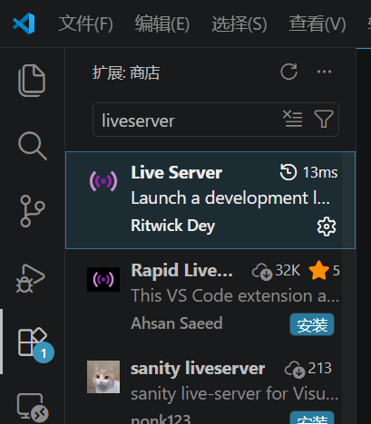

点击`安装`. 

> VScode是一款文本/代码编辑软件, 用于对Mobamas的剧情脚本进行修改.
>
> Live Server插件用于在本地以服务器形式打开网页文件.

#### Flasm

打开[Flasm](https://flasm.sourceforge.net/#download) 的官网. 找到`Download`

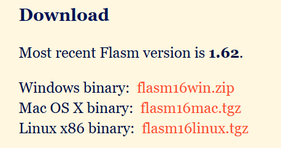

下载"Windows binary"对应的压缩包, 解压到某个位置, 如 `D:\Program\flasm` .

进入flasm软件目录, 复制当前文件夹的地址.

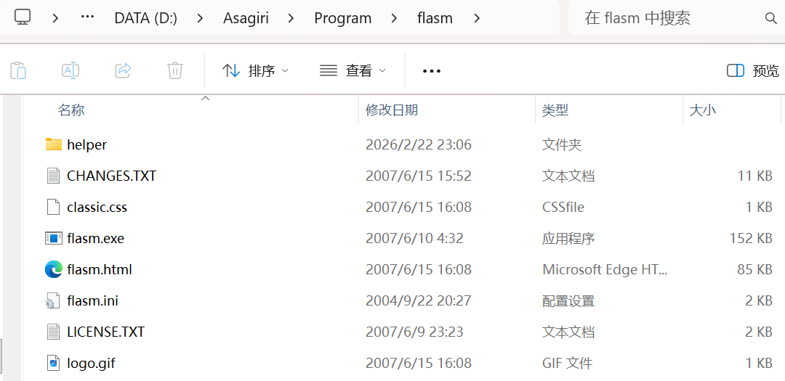

在Windows的搜索栏搜索"环境变量"

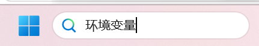

点击"编辑系统环境变量".

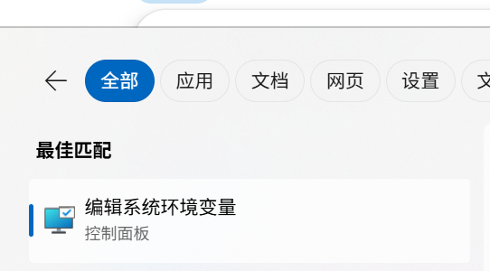

点击右下角的"环境变量"

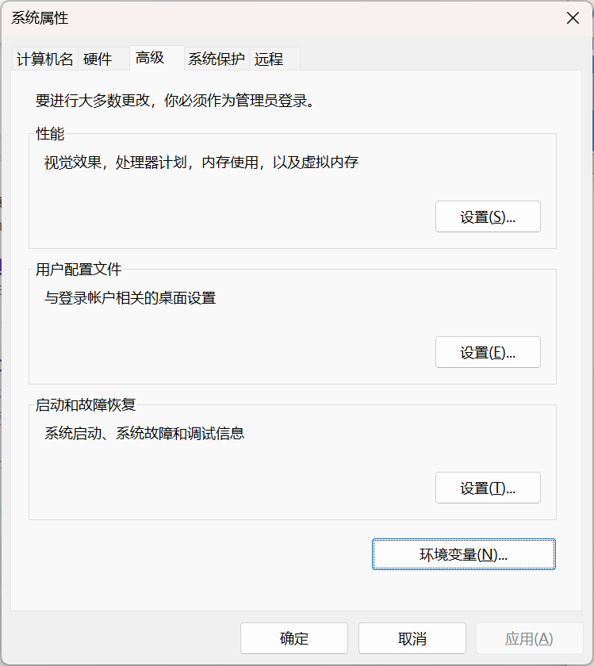

找到"用户变量"中的"Path"变量, 点击"编辑".

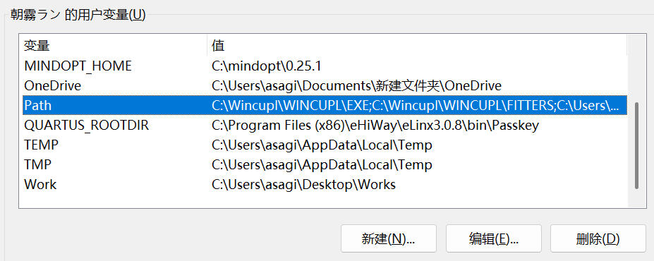

再点击"新建", 把刚才复制的flasm软件目录粘贴进去, 点击"确定".

使用Win+r快捷键打开"运行", 输入"cmd", 打开"命令提示符"终端, 输入`flasm`, 回车, 如果终端输出如下所示内容, 说明flasm成功添加到了环境变量中.

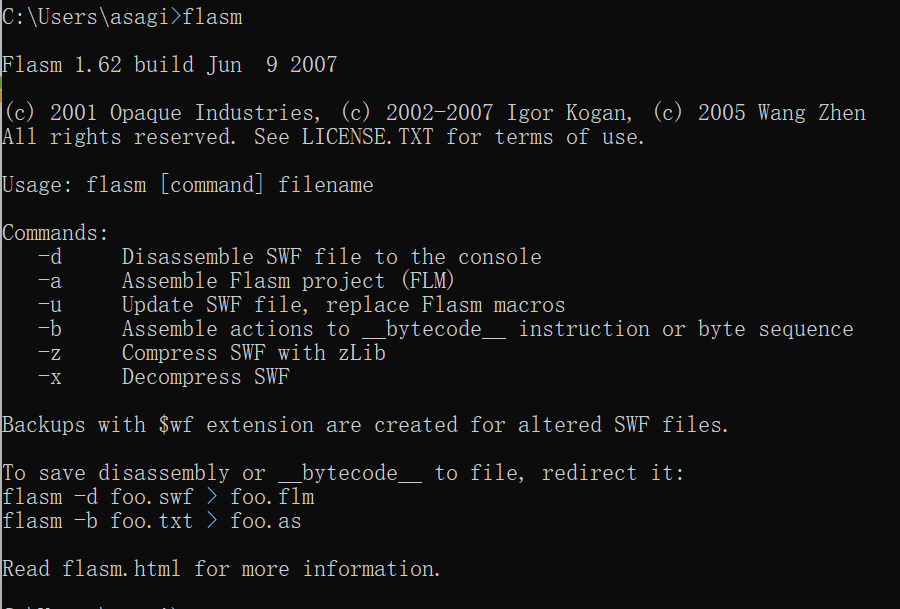

> flasm用于对.swf格式(Flash)的剧情脚本中进行解包, 输出能够直接编辑的代码文件.

#### FFDec

打开 [FFDec](https://github.com/jindrapetrik/jpexs-decompiler/releases/tag/version26.0.0)的Github主页, 下载对应的软件包即可.

> FFdec用于对.swf格式的剧情脚本中的图形, 字体文件进行修改.
>
> (虽然FFdec也能修改代码, 但操作不如flasm简洁)

## 复现

#### 偶像画廊(アイドルギャラリー)

使用VScode打开Mobamas文件夹.

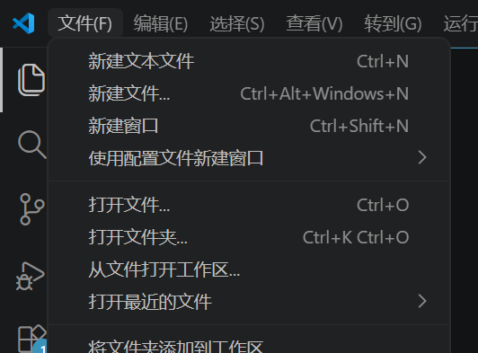

在"资源管理器"中能看到如下的文件结构:

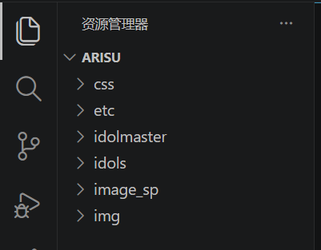

找到 `idols\偶像名\index.html` , 右键, 选择"Open with Live Server".

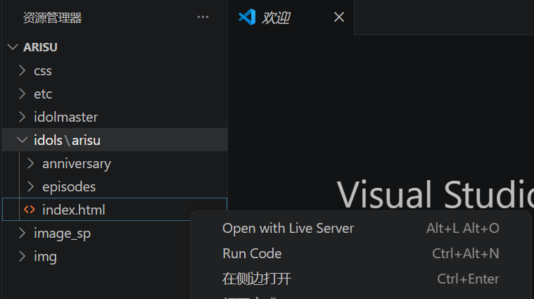

此时会打开浏览器, 并显示偶像的"アイドルギャラリー"页面:

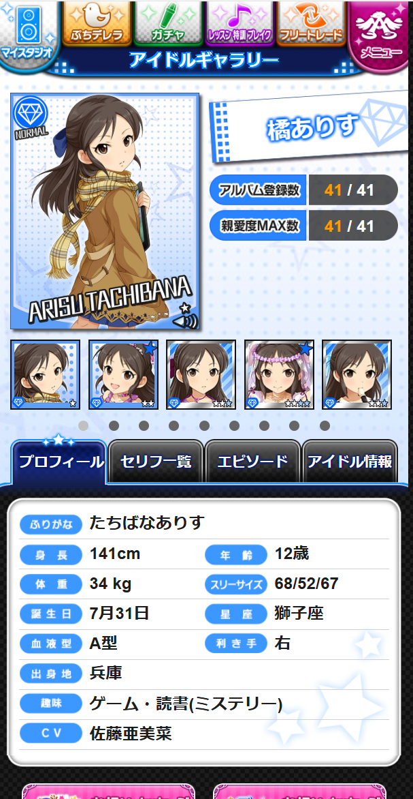

在该页面中, 可以浏览偶像的卡面, 台词, 剧情等内容.

#### 剧情(思いだエピソード)

> Mobamas的剧情页面, 本质上也是一个html网页, 因此可以绕过"アイドルギャラリー", 直接播放.

打开偶像的某个エピソード剧情, 通过网址栏的网址, 可以定位剧情网页文件所在位置.

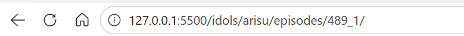

在VScode中, 找到对应位置, 为`idols\偶像名\episodes\剧情编号`

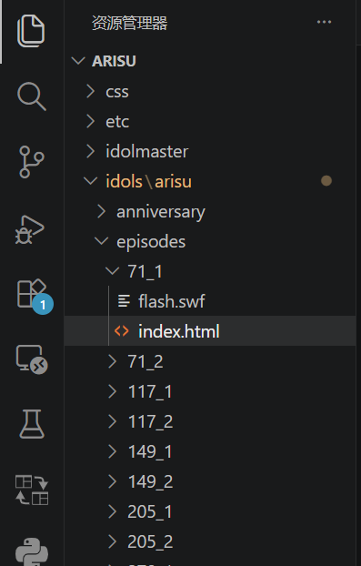

`idols\偶像名\episodes`包含了所有的思いだエピソード剧情文件, 不同剧情使用名称不同的文件夹进行分隔.

右键`index.html`, 选择"Open with Live Server", 在浏览器中会打开该页面, 进行剧情播放.

#### 台词

> 台词提取自アイドルギャラリー页面

台词位于主目录下的`comments.txt`文件.

台词类型对照表:

| 字段                  | 台词类型                |
| --------------------- | ----------------------- |
| comment               | アイドルコメント        |
| comments_my_1         | マイスタジオ            |
| comments_my_2         | マイスタジオ            |
| comments_my_3         | マイスタジオ            |
| comments_my_4         | マイスタジオ            |
| comments_my_max       | マイスタジオ(親愛度MAX) |
| comments_work_1       | お仕事                  |
| comments_work_2       | お仕事                  |
| comments_work_3       | お仕事                  |
| comments_work_4       | お仕事                  |
| comments_work_max     | お仕事(親愛度MAX)       |
| comments_work_love_up | お仕事(親愛度UP)        |
| comments_live         | LIVEバトル              |
| comments_love_max     | 親愛度MAX演出           |

#### 迷你灰姑娘(ぷちデレラ)

##### ぷち台词

打开 `etc\puchi\偶像名`文件夹, 原始台词文件位于json文件中, 提取整理后的台词文件为`output.txt`.

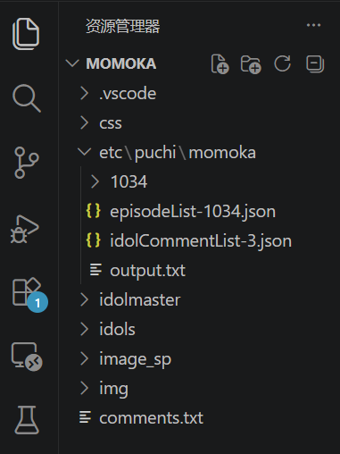

##### ぷち剧情

ぷち剧情位于`etc\puchi\偶像名\偶像编号`文件夹中, 文件结构与"剧情(思いだエピソード)"相同. 同样地, 右键`index.html`, 选择"Open with Live Server", 在浏览器中会打开该页面, 进行剧情播放.

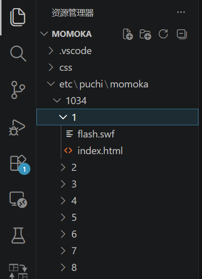

## 汉化

### 前言

通过"复现"部分内容, 你对Mobamas的文件目录结构应该有了一个初步的了解, 接下来讲解如何进行剧情汉化.

**思い出エピソード剧情**可以分为以下四类:

- flash剧情：使用flash实现，文件夹内有swf文件
  - 前篇剧情
  - 后篇剧情：存在逐帧演出
- h5剧情：使用html和js实现，文件夹内只有html文件
  - 前篇剧情
  - 后篇剧情：存在逐帧演出

**ぷちデレラ剧情**的汉化方法与flash剧情-前篇剧情一致.

对不存在逐帧演出的前篇剧情, 只需要进行简单的文本替换即可;

对存在逐帧演出的后篇剧情, 需要进行逐帧修改, 相对复杂.

### flash剧情-前篇剧情