# モバマス汉化流程

[TOC]

## 工具准备

### 游戏环境搭建

#### 主数据

下载云盘中的`Mobamas/mobamas.zip`并解压. 作为游戏环境目录.

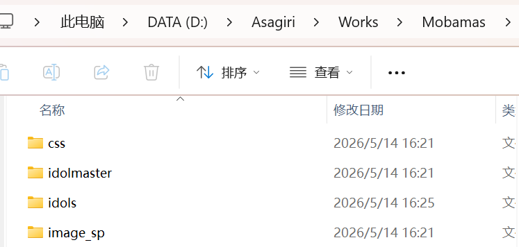

> 主数据是必不可少的. 偶像数据, Cinderella History和Refresh Room可以按需下载.

#### 偶像数据

在游戏环境目录新建`idols`文件夹.

在云盘中的`偶像数据`文件夹中, 下载偶像数据压缩包, 并解压到`idols`文件夹.

> **注意**: 文件夹名称要和和压缩包名称相同, 不要更改.

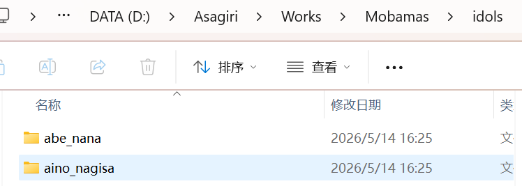

#### Cinderella History

把云盘中`history.zip`内的`image_sp`和`history`文件夹, 解压到游戏环境目录.

#### Refresh Room

在游戏环境目录中新建`refresh`文件夹, 把云盘中的`refresh.zip`解压进去.

#### 部分剧情需要的文件

部分偶像的H5剧情需要额外的文件.

如果在播放偶像剧情时出现人物立绘消失的问题, 下载云盘中`Mobamas/部分剧情需要的文件/mobamas.zip`, 解压到游戏环境目录.

### 翻译工具

#### 文件部署

下载云盘中的`翻译工具/IMASTranslationTool.zip`并解压:

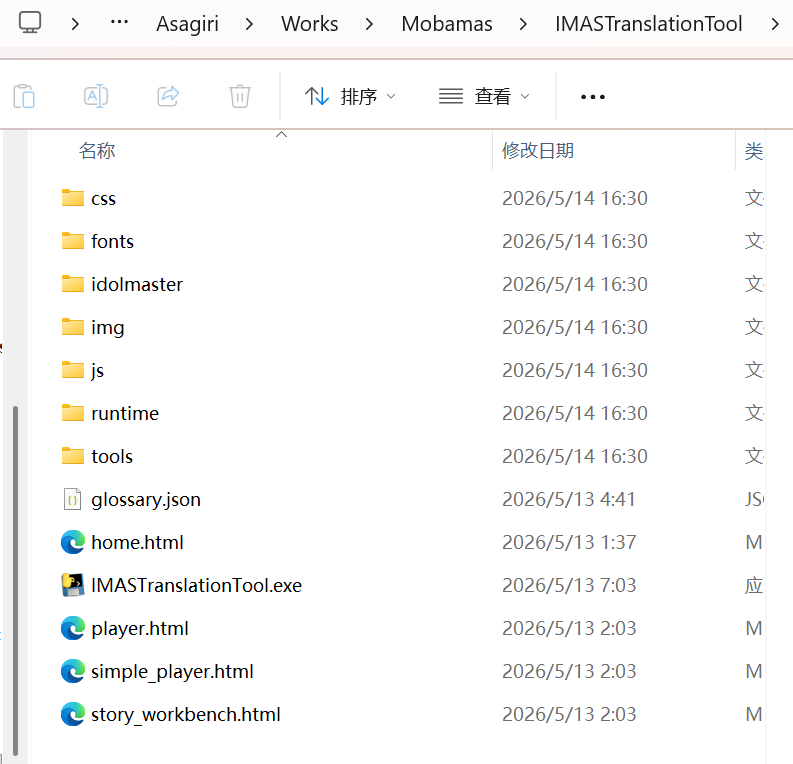

把文件夹里所有文件, 移动到游戏环境目录中:

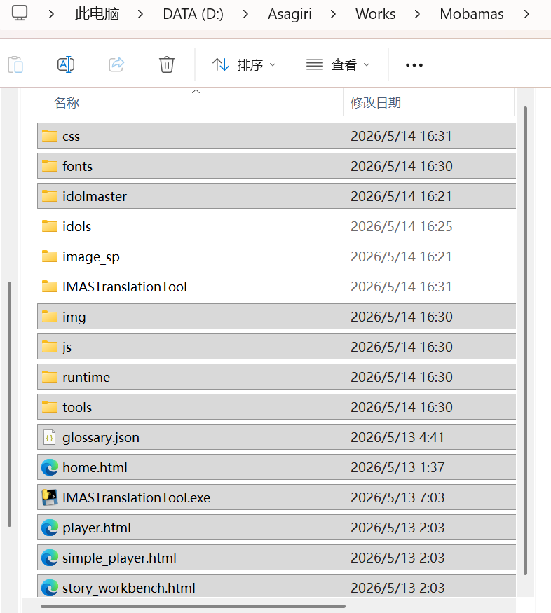

双击`IMASTranslationTool.exe`, 浏览器访问`http://127.0.0.1:8765`, 即可进入翻译工作页面.

#### 工作区

如果游戏环境正确搭建, 那么页面上会显示游戏环境目录中包含的偶像数据:

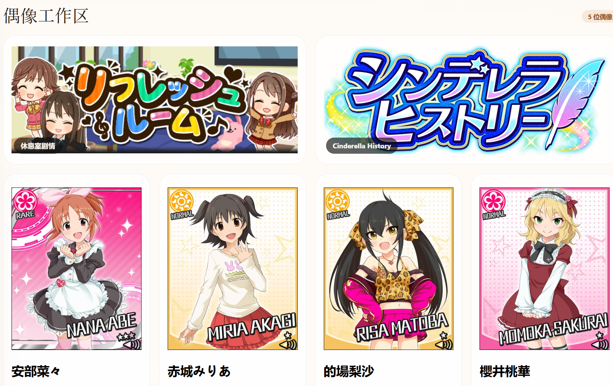

#### 配置远程仓库

把`remote_config.json`放入游戏环境目录中, 使用文本编辑器打开:

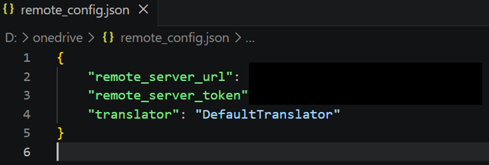

正确设置`remote_server_url`和`remote_server_token`, 然后把`DefaultTranslator`改成自己即可.

## 汉化流程

**汉化协作大厅**: [モバマス汉化进度大厅](https://mobamascn.top/)

==注意==: 准备汉化之前, 请先访问汉化协作大厅, 确认一下剧情/台词状态. 避免多人汉化同一内容.

### 本地汉化

#### 一般剧情

运行翻译工具, 使用浏览器打开`http://127.0.0.1:8765`.

选择一个剧情, 开始翻译:

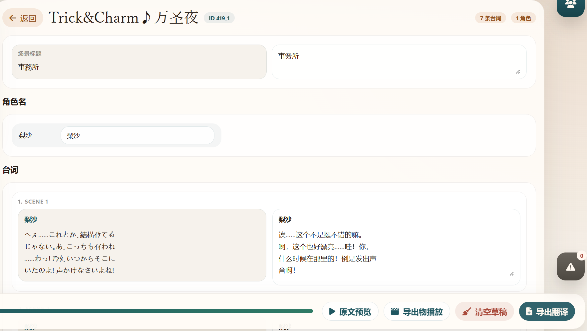

"导出翻译"后, 点击"导出物播放"或"草稿预览", 可以对汉化后的剧情进行预览.

#### 后篇剧情

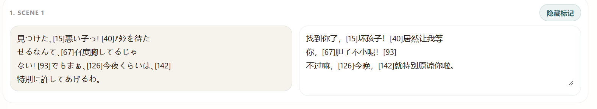

如图所示, 后篇剧情的台词中带有标记. 标记用于分割不同帧的台词.

翻译时要注意正确设置标记.

#### 卡面&台词

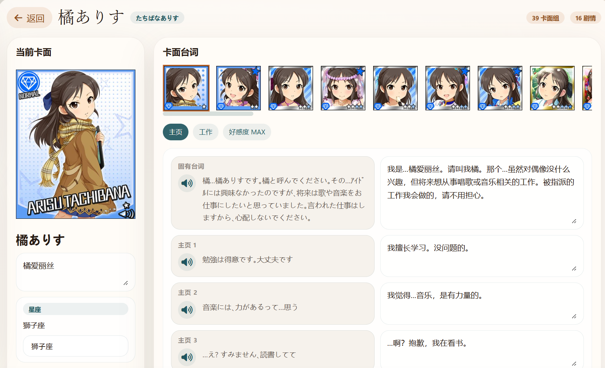

注意台词不要换行. 翻译完成后, 点击"导出台词即可". 

#### 上传文件

确认翻译后的剧情/台词无误后, 返回翻译工具首页, 点击"上传导出物":

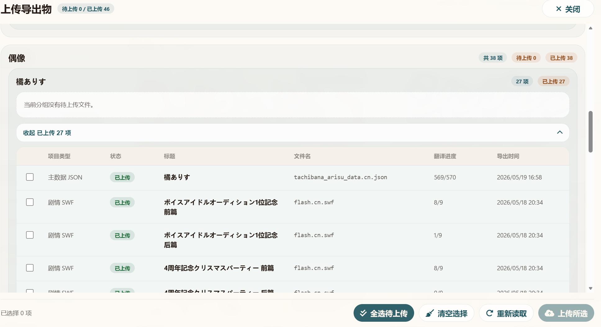

### 远程协作

访问[モバマス汉化进度大厅](https://mobamascn.top/)

点击右上角的"游客模式", 输入协作者ID和协作者Token, 切换到协作者模式.

#### 剧情

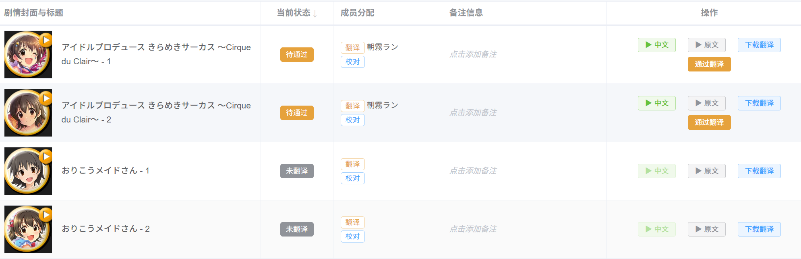

成功上传文件后, 对应的剧情会从"未翻译"变为"待通过".

在右边的操作栏, 可以播放原文/中文剧情. 确认剧情无误后, 点击"通过翻译", 剧情状态会从"待通过"变为"翻译完成":

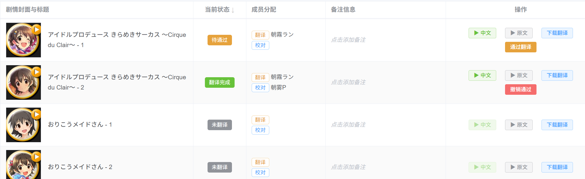

翻译完成的剧情, 将会"锁定"和"公开". "锁定"即不再接收新的文件上传; "公开"即将此剧情向游客公开.

#### 台词

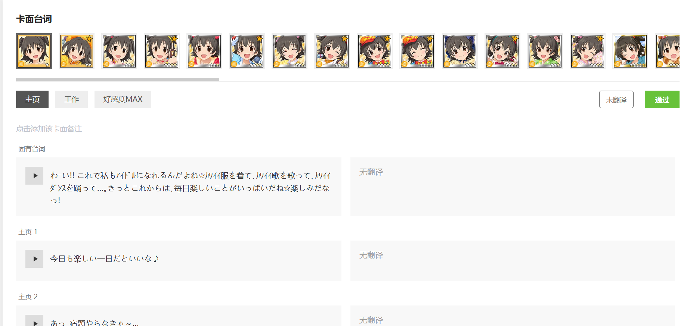

台词的管理模式比较简单. 

在工作台上传台词文件后, 协作大厅会自动更新中文台词. 确认台词无误后, 点击"通过", 该卡面的台词就公开了.

> 注意台词没有锁定机制, 即使"通过"之后, 新台词也会覆盖旧台词.

