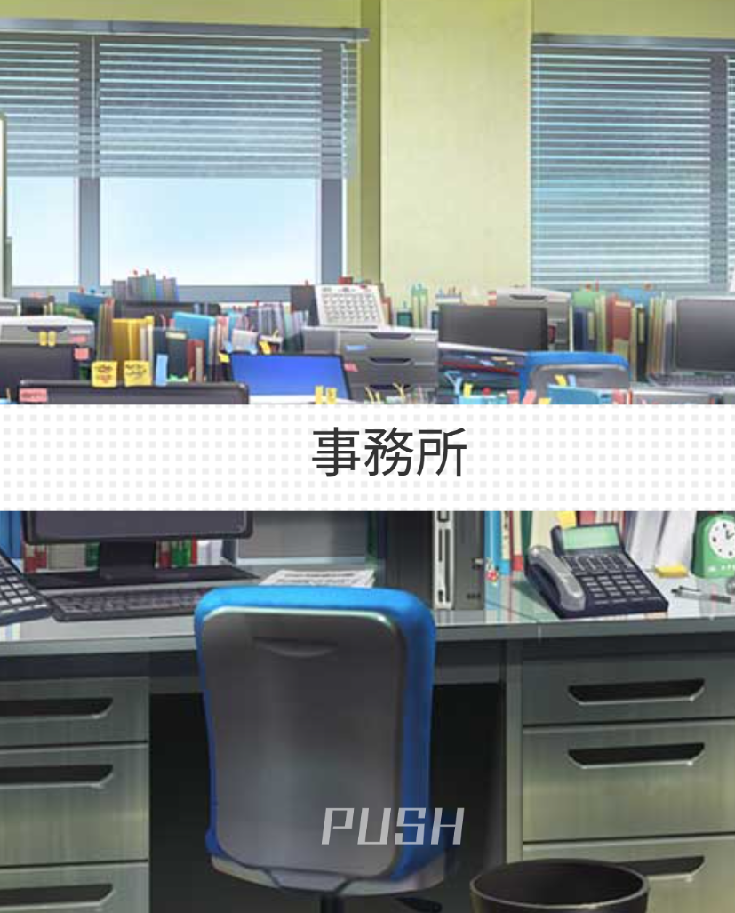
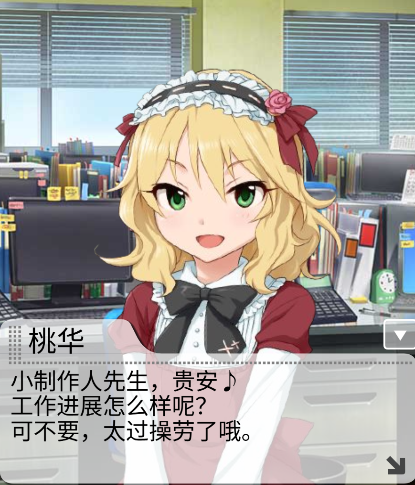
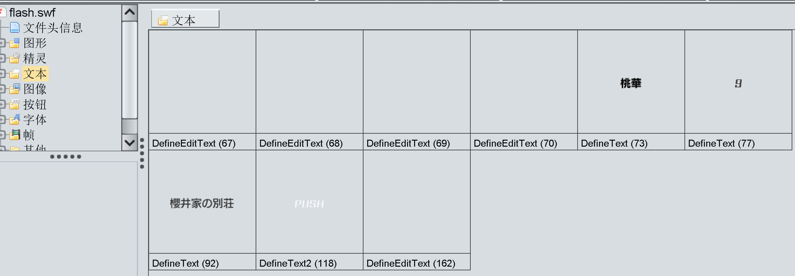
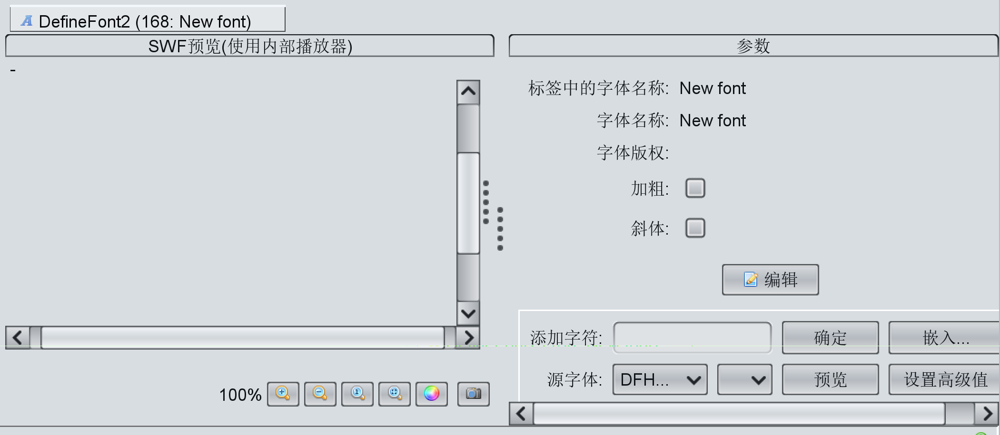

# Mobamas汉化笔记

[TOC]

## 汉化目标

需要进行汉化的内容如下：

- **卡片**：包括卡片名称、台词
- **剧情**：剧情类别如下
  - 思い出エピソード（回忆剧情）：主要是卡片剧情
  - ぷちデレラ（迷你灰姑娘）：ぷちデレラ的训练剧情
  - リフレッシュルーム（Refresh Room）
  - シンデレラヒストリー（Cinderella History）
  - 其他
- **灰姑娘剧场漫画**：使用PS或其他图片编辑软件进行汉化
- **其他**：生日台词、迷你灰姑娘台词等

## 前置准备

**所需软件**：Visual Studio Code、flasm、FFdec

VScode下载链接：https://code.visualstudio.com/download

还原Mobamas环境，需要以服务器的形式打开游戏数据中的html文件，可以使用apache、nginx等软件搭建本地服务器。但最简便的方法是使用VScode插件。

将包含Mobamas各种数据的文件夹使用VScode打开，确保html引用的js、css等文件在文件夹内。

在VScode中安装Live Server插件，在左侧文件列表里右键html文件，点击"Open with Live Server"。

以剧情为例，live server打开的页面中剧情可以正常播放即可。如果播放错误右键页面->检查->控制台，查看报错信息，是否有缺少的文件。



flasm下载链接：https://flasm.sourceforge.net

flasm用于对swf文件的Pcode代码进行编辑。解压缩后，把安装目录添加进环境变量，以便在其他目录可以使用flasm命令。

FFdec下载链接：https://github.com/jindrapetrik/jpexs-decompiler

FFdec用于反编译swf文件，对各种资源文件进行修改。

## 卡片

卡片的相关数据使用json储存，或直接写在html文件里某个变量里。找到对应代码，可以看到以下结构：

```json
"detail_list": [
		{
            "data": {
				......
			},
			"profile": {
				......
			},
			"comments": {
				......
			},
			......
        }
    ]
```

其中，`profile`中的`card_name`字段，是卡片名称；`comments`对象中的内容是台词。

| 字段                  | 台词类型                |
| --------------------- | ----------------------- |
| comment               | アイドルコメント        |
| comments_my_1         | マイスタジオ            |
| comments_my_2         | マイスタジオ            |
| comments_my_3         | マイスタジオ            |
| comments_my_4         | マイスタジオ            |
| comments_my_max       | マイスタジオ(親愛度MAX) |
| comments_work_1       | お仕事                  |
| comments_work_2       | お仕事                  |
| comments_work_3       | お仕事                  |
| comments_work_4       | お仕事                  |
| comments_work_max     | お仕事(親愛度MAX)       |
| comments_work_love_up | お仕事(親愛度UP)        |
| comments_live         | LIVEバトル              |
| comments_love_max     | 親愛度MAX演出           |

只需要对原文本进行提取或者替换即可。

> 台词可能显示为如`\u3053\u3063\u3061\u306e`的文本，这是Unicode转义序列，需要将其转换回日文文本。推荐使用VScode的Unicode Conversion插件。

## 剧情

### 思い出エピソード

回忆剧情文件可以进行以下分类：

- flash剧情：使用flash实现，文件夹内有swf文件
  - 前篇剧情
  - 后篇剧情：存在逐帧演出
- h5剧情：使用html和js实现，文件夹内只有html文件
  - 前篇剧情
  - 后篇剧情：存在逐帧演出

#### flash-前篇剧情

修改剧情脚本需要使用软件对.swf文件解包，本文以flasm为例。

打开剧情所在文件夹，右键选择“在终端中打开”，使用命令行进行操作。

执行`flasm swf_name.swf`命令（把swf_name替换成实际的swf文件名字），当前目录会生成`swf_name.flm`，这是导出的Pcode资源。使用文本编辑器打开`swf_name.flm`，会看到如下代码：

```
frame 0
    push 'url'
    push '......'
    setVariable
    push 'voice_path1'
    push './音频路径'
    setVariable
    .......
    push 'text_1_1'
    push '这是一条台词。'
    setVariable
    ......
    push 'name1'
    push '偶像名字'
    ......
    push 'msg1'
    push '这是一条台词。\n这是下一行台词。'
    setVariable
    ......
```

`voice_path1`是语音所在路径；`name1`是偶像名；`text_1_1`和`msg1`是台词，两组台词内容是相同的。

实际播放时读取的台词内容是`msg`下的台词，因此修改这部分台词即可。注意`\n`为换行符，使用换行符分割的文本会逐行显示，在进行汉化时也应合理设置换行。

汉化完成后，执行命令`flasm -a swf_name.flm `，如果命令行输出`swf_name.flm successfully assembled to swf_name.swf`，说明成功写入swf文件。

> 不同swf文件的代码结构有可能不同，但只要找到对应日文文本进行替换就行。

> 如果swf_name.flm中的日文显示为乱码，把编码改为Shift JIS可解决。

再次使用live server打开文件夹内的html，文本发生改变，说明汉化成功。




#### flash-后篇剧情

**初步汉化**

按照前篇剧情的汉化流程，对后篇剧情进行初步汉化，随后进行演出部分的汉化。

**演出汉化**

mobamas的特训后剧情存在逐帧的演出，每一帧的台词显示有区别。在pcode代码中，需要找到每一帧中控制台词显示的代码，进行文本替换。

打开.flm文件，代码使用`frame 编号`划分帧数，通过搜索`push 'm1'`，找到第一个结构与以下代码类似的帧数：

```
frame 编号
    ......
    push 'm1'
    push '第1行台词'
    setVariable
    push 'm2'
    push ''
    setVariable
    ......
  end // of frame 编号
```

这是演出的第一帧，`push 'm1'`是选中文本框第一行，下面一行的`push '第1行台词'`是台词内容，`setVariable`是使文本显示。汉化时对台词内容进行替换。

继续向下，找到第下一个代码结构与上面类似的帧数，进行修改。以此类推。

有些frame内的代码是这样的：

```
	......
	push 'm1'
    push 't'
    push 'idx'
    getVariable
    concat
    push '_1'
    concat
    getVariable
    setVariable
    ......
```

形如这样的代码，功能是“将该行的台词全部渲染出来”，需要修改这部分时，为了修改方便，直接替换为

```
	push 'm1'
    push '第1行台词'
    setVariable
```

这种形式即可。

修改完所有台词演出的帧数后，演出部分汉化完成。

**偶像名&场景名汉化**

与前篇剧情不同，后篇剧情的“偶像名”和“场景名”并不是写在Pcode代码里的，而是储存在“文本”资源中，因此需要功能更强大的软件FFdec。

使用FFdec打开.swf文件，点击左侧的“文本”资源，可以看到“偶像名”和“场景名”：



双击打开，在右侧的“参数”中可以看到如下代码：

```
[
xmin 1264
ymin 134
xmax 2163
ymax 416
][
font 字体编号
height 字体大小
color #333333
x x坐标
y y坐标
]场景名/偶像名
```

此时不能直接修改“场景名/偶像名”。

在FFdec左侧找到“字体”资源，右键“在内部添加标签”，选择"DefineFont2"，依赖帧选择frame 1内部标签即可，随后选中新添加的字体：




点击确定后，在右侧的“参数”窗口中，在“添加字符”文本框输入汉化后的文本，点击“嵌入”，选择字体。如果要使用外部字体，就勾选"TTF文件"，然后选择外部TTF字体文件。

此时再查看字体资源，会出现添加的新字体`DefineFont2(字体编号)`。

回到文本资源，将偶像名/场景名中的`font`参数修改为新字体的编号，再修改场景名/偶像名，适当调整x坐标、y坐标和字体大小。

在FFdec左上角点击“保存”，偶像名&场景名汉化完成。

#### H5-前篇剧情

**剧情汉化**

前篇剧情脚本写在JS或HTML文件中。

打开文件，找到`window.im_cjs`对象，找到`scene_list`字段，可以看到如下代码：

```javascript
"scene_list": [{
					"id": "1",
					"story_id": "20507",
					"character_id": "10188",
					"cname": "",
					"height_diff": "",
					"face": "2",
					"position": "C",
					"movement": "in_float",
					"chara_effect": "",
					"effect_direction": "",
					"a_fade": "",
					"": "",
					"bgimg": "00002",
					"message": "这是一句台词。\n这是下一句台词",
					"timing": "",
					"auto": "1",
					"sound_effect": ""
				}, {
```

需要修改的是`message`字段。

**偶像名/场景名汉化**

偶像名：找到`window.im_cjs.chara_frame_info`，修改`name`字段；

场景名：找到`window.im_cjs.title_name`，进行修改。

#### H5-后篇剧情

**初步汉化**

打开`talk.js`，看到如下代码：

```javascript
第1句台词
window.im_cjs.t[1][1] = "第一行台词";
window.im_cjs.t[1][2] = "第二行台词";
window.im_cjs.t[1][3] = "第三行台词";
window.im_cjs.t[1][4] = "第四行台词";
//第2句台词
window.im_cjs.t[2][1] = "第一行台词";
window.im_cjs.t[2][2] = "第二行台词";
window.im_cjs.t[2][3] = "第三行台词";
window.im_cjs.t[2][4] = "第四行台词";
......
```

直接替换台词即可，注意断句。

**演出汉化**

打开另一个js文件，搜索`exportRoot._g.m1`，找到如下代码：

```javascript
this.frame_15 = function() {
		exportRoot._g.m1 = "第一行台词";
		exportRoot._g.m2 = "第二行台词";
		exportRoot._g.m3 = "第三行台词";
		exportRoot._g.m4 = "第四行台词";
		exportRoot._u.setText();
		
		exportRoot._u.setFace("ch1", 8);
		this.ch1.gotoAndPlay("swing_bleth");
	}
	this.frame_
```

逐帧修改，思路与flash特训后剧情基本一致。

**偶像名/场景名汉化**

搜索`(lib.window = function(mode,startPosition,loop)`，在该行代码下方，可以看到如下代码：

```javascript
	......
	// dummy
	this.shape = new cjs.Shape();
	this.shape.graphics.f("#000000").s().p("svg_string");
	this.shape.setTransform(56.025,11.9);

	this.shape_1 = new cjs.Shape();
	this.shape_1.graphics.f("#000000").s().p("svg_string");
	this.shape_1.setTransform(40.2,12);

	......

	// text
	......
```

dummy部分的代码使用矢量图绘制偶像名，再渲染到界面上。

矢量图修改比较不便，因此把矢量图替换为普通的文字层：

```javascript
	// dummy
    // 参数：文本内容, 字体样式, 颜色，自行调整
    this.nameText = new cjs.Text("偶像名", "bold 15px 'Microsoft YaHei', sans-serif", "#000000");
    // 设置名字的位置，需要微调 
    this.nameText.setTransform(20, 6); 
    //渲染
    this.timeline.addTween(cjs.Tween.get({}).to({state:[{t:this.nameText}]}).wait(4));
```

搜索`(lib.tie = function(mode,startPosition,loop)`，看到如下代码：

```javascript
// txt
	this.shape = new cjs.Shape();
	this.shape.graphics.f("#333333").s().p("svg_string");
	this.shape.setTransform(40.15,0.525);

	......
```

这是场景名，同样使用矢量图绘制。

将其替换为普通的文字层：

```javascript
// txt
    this.placeName = new cjs.Text("场景名", "bold 16px 'Microsoft YaHei', sans-serif", "#333333");
    
    this.placeName.textAlign = "center";    // 居中对齐
    this.placeName.textBaseline = "middle"; // 垂直居中
    
    // 坐标调整
    this.placeName.setTransform(0, 2); 

    // 渲染
    this.timeline.addTween(cjs.Tween.get({}).to({state:[{t:this.placeName}]}).wait(1));
```

#### 收尾工作

使用文本编辑器打开用于播放剧情的html，将`<html lang="ja" xml:lang="ja">`修改为`<html lang="zh-CN" xml:lang="zh-CN">`，即将日文页面修改为中文页面，避免字体混乱。

修改html调用的剧情文件，以便中文日文剧情共存。

### ぷちデレラ

迷你灰姑娘剧情与flash-前篇剧情的汉化方法一致，不做赘述。

### リフレッシュルーム

**文本汉化**

打开`refresh_room_编号.json`文件，搜索`detail`，看到如下代码：

```javascript
"detail": [
    {
      "id": "1",
      "refresh_room_id": "19",
      ......
      "message": "这是台词",
      ......
    },
    {......
```

`id`是台词编号，`message`是台词内容，对每个`message`进行替换即可。

**偶像名汉化**

偶像名为图片，修改`name_plate`文件夹下的图片即可。

### シンデレラヒストリー

history剧情与回忆剧情-前篇剧情的汉化方法一致，不做赘述。

## 其他

### 修改剧情播放结束后行为的方法

在播放剧情的html文件中插入调试代码：

```
<script>
	window.addEventListener("beforeunload", function() {debugger;});
</script>
```

打开浏览器控制台，剧情播放结束后触发断点。

查看堆栈，定位代码，通常的行为是使用`window.location.href`进行页面跳转，修改即可。

### 关于flash解包工具

由于.swf的剧情文件中的文本可能使用Shift JIS编码，而FFdec默认使用UTF-8编码，并且不支持切换编码，不建议使用FFdec进行处理。

在powershell下使用flasm时，如果使用`flasm -d swf_name.swf > script.txt`将Pcode代码重定向到`script.txt`，powershell会自动以UTF-16编码保存，导致文本出错，因此建议使用cmd。
